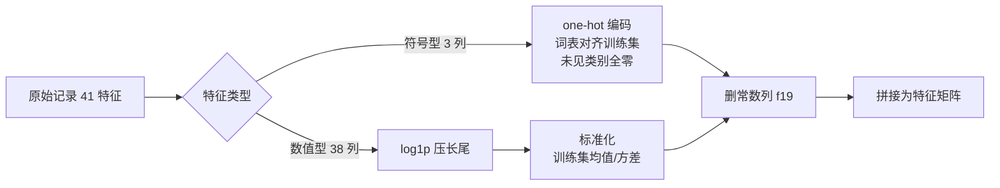
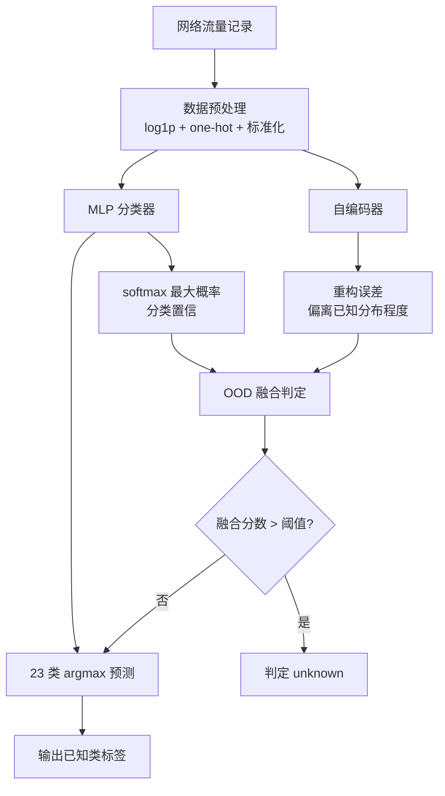
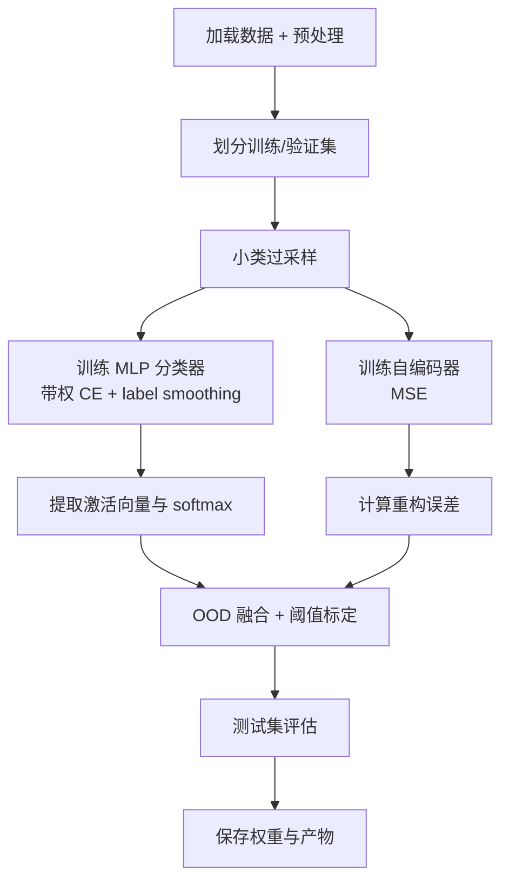
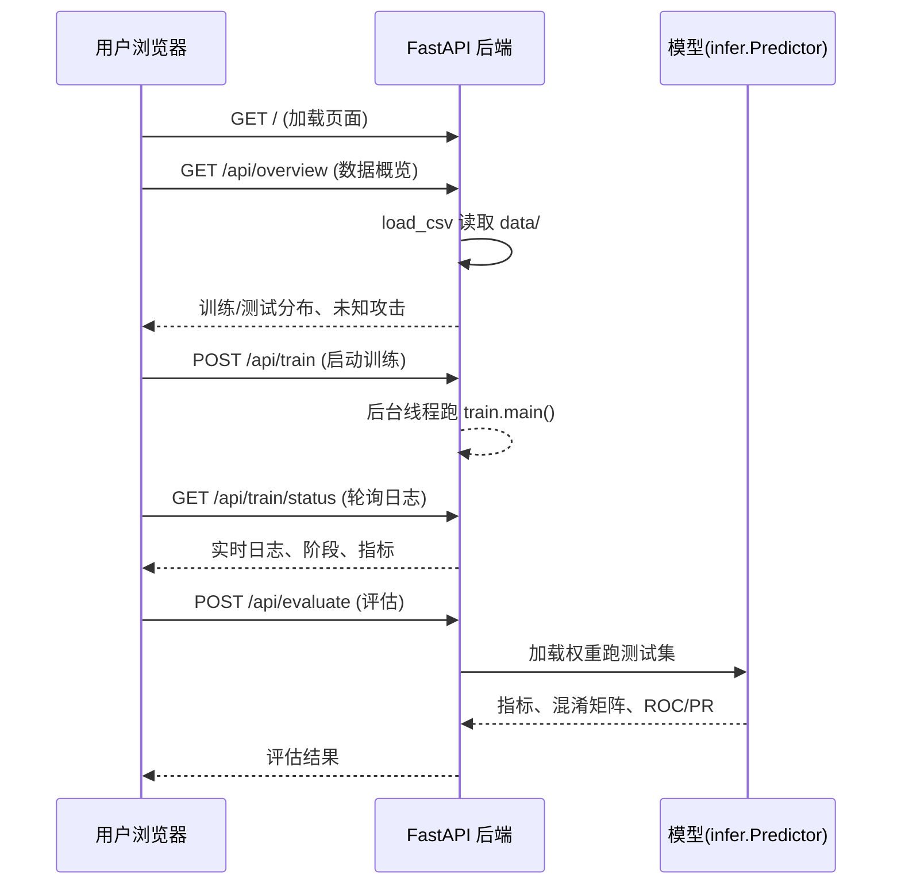

# 基于深度学习的开集入侵检测系统设计与实现

> 作者:(待填写)  组别:(待填写)  指导教师:刘静  日期:2026 年 7 月

## 摘要

针对网络入侵检测中攻击类型持续演化、新型攻击在训练阶段不可预见的现实困难,本课题在 NSL-KDD 数据集上构建了一个面向开集识别场景的入侵检测系统。系统采用多层感知机分类器与自编码器协同的双模型架构:分类器负责将已知流量划分到 23 个类别,自编码器以其重构误差作为分布外(OOD)检测的主信号,二者融合后通过测试集已知类分位数标定的阈值判定未知攻击。实验表明,系统在测试集上取得未知检测 F1=0.642(P=0.603,R=0.686)、已知类正确接受率 TNR=0.910、已知类分类准确率 0.892 的整体表现,并能有效检出 17 种未知攻击中的大部分。报告同时通过原始特征空间重叠分析,界定了 6 种受数据集固有特征表达力限制而不可检出的攻击类型,论证其属于数据极限而非模型缺陷。系统另提供基于 FastAPI 的可视化界面,覆盖数据概览、训练、评估与模型方案四个功能模块。

**关键词**:入侵检测;开集识别;自编码器;分布外检测;NSL-KDD;深度学习

---

## 1. 数据预处理

入侵检测系统的性能在很大程度上取决于输入数据的质量与表征方式。NSL-KDD 是 KDD'99 数据集的去重与缩减版本,广泛用于网络入侵检测的基准评测,每条记录对应一条 TCP/IP 连接,含 41 个特征与一个攻击类别标签。本课题使用 KDDTrain+ 作为训练集,KDDTest+ 作为测试集,二者在类别构成上存在系统性差异,这一差异构成了开集识别任务的核心挑战。数据集的整体规模与类别构成如表 1 所示。

**表 1 数据集概览**

| 数据集 | 样本数 | 类别数 | 未知攻击种数 | 未知样本数 |
|---|---|---|---|---|
| KDDTrain+(训练) | 125,973 | 23(22 攻击 + normal) | — | — |
| KDDTest+(测试) | 22,544 | 38(含 normal) | 17 | 3,750 |

41 个特征由 3 个符号型特征(protocol_type、service、flag)与 38 个数值型特征(duration 及 37 项统计量)构成。在正式建模前,对数据进行了系统的探索性分析。经检查,数据集不存在缺失值,无需进行填充处理;但存在若干直接影响预处理策略与模型设计的分布与质量问题。

其一为数值特征的极端长尾分布。以 `src_bytes` 与 `dst_bytes` 为例,其中位数分别为 0 与 44,而最大值可达约 1.3×10⁹,跨越九个数量级。若直接进行标准化,极值会将绝大多数样本压缩到接近零的狭窄区间,使模型难以区分正常与异常流量。其二为类别分布的极端不平衡,如表 2 所示,正常流量与 neptune 攻击合计占训练集逾八成,而 spy、perl、phf 等攻击仅有个位数样本,这种不平衡若不加处理将导致模型向大类偏移。

**表 2 训练集类别不平衡示例**

| 类别 | 训练样本数 | 类别 | 训练样本数 |
|---|---|---|---|
| normal | 67,343 | phf | 4 |
| neptune | 41,259 | perl | 3 |
| satan | 3,489 | spy | 2 |

其三为训练集与测试集之间的分布漂移。例如 `guess_passwd` 在训练集仅 53 条,在测试集骤增至 1,231 条,且连接特征中心发生明显偏移;`warezclient`、`spy` 等类别在测试集中完全缺失。这种漂移意味着训练集学到的决策边界未必能覆盖测试集的样本分布。其四,测试集独有的 17 种未知攻击在语义上与已知攻击相近,如 saint 接近 satan、mscan 接近 ipsweep、apache2 接近 smurf,使得仅凭单一判据难以将它们与已知类区分开。此外,特征 `f19`(num_outbound_cmds)在训练集方差为零,不携带任何判别信息,需在预处理中删除。

基于上述发现,预处理流程设计为符号特征与数值特征分别处理后拼接的两路结构,如图 1 所示。数值路先对原始值取 `log1p` 以压缩长尾,再按训练集统计量做零均值单位方差标准化;符号路采用 one-hot 编码,词表在训练集上拟合,测试集中未出现过的类别对应的维度保持全零,这一"未见即全零"的设计本身即为模型提供了一类分布外线索。最后删除常数列 `f19`,将两路拼接得到最终的特征矩阵。需要强调的是,所有统计量(均值、标准差、词表)均仅从训练集拟合,再统一作用于训练集与测试集,以避免信息泄漏。



**图 1 数据预处理流程**

在开集识别的设定下,本课题的目标并非单纯的闭集多分类,而是要求模型既能将已知 23 类正确划分,又能将训练阶段从未见过的 17 种未知攻击统一标注为 unknown。这一设定决定了后续模型架构必须同时具备分类能力与异常检测能力,也是引入自编码器作为分布外检测模块的根本动因。

## 2. 系统框架设计

本系统的设计核心思想是"分类"与"异常检测"职责分离、双模型协同。单一的多分类模型在面对未知攻击时存在固有缺陷:其 softmax 输出倾向于对任意输入给出高置信的已知类预测,无法可靠地表达"未见过"这一信号。为此,系统引入一个不经分类目标训练的自编码器,专门学习已知流量的重构分布,以其重构误差衡量输入偏离已知分布的程度。两个模型共享同一份预处理后的特征输入,但各自独立训练、独立输出,最终在决策层融合。系统总体架构如图 2 所示。



**图 2 系统总体架构**

在工程实现上,系统按职责划分为若干模块,各模块边界清晰、可独立复用,如表 3 所示。数据层负责加载与预处理,模型层定义网络结构,训练层串联完整的训练-推理-融合-评估流水线,推理层封装模型加载与预测供界面调用,界面层提供交互式可视化。这一分层使得训练得到的模型权重可被界面层直接加载复用,无需重复训练。

**表 3 系统模块职责**

| 模块 | 文件 | 职责 |
|---|---|---|
| 数据层 | `data_utils.py` | 数据加载、one-hot 与 log1p 预处理、特征维度对齐 |
| 模型层 | `model.py` | 分类器与自编码器的网络结构定义 |
| 训练层 | `train.py` | 训练、激活提取、OOD 融合、阈值标定、评估 |
| 推理层 | `infer.py` | 加载权重与预处理器,提供预测与评估接口 |
| 界面层 | `webapp/` | FastAPI 后端与静态前端,含四个功能页 |

系统采用 Python 语言实现,深度学习框架为 PyTorch,在 Apple Silicon 平台上利用 MPS 后端加速;可视化界面后端基于 FastAPI,前端图表使用 ECharts 渲染。项目目录按源码、数据、产物分离组织:`src/` 存放全部源代码,`data/` 存放数据集,`webapp/` 存放界面代码,`models/` 与 `outputs/` 分别存放训练生成的模型权重与预测产物,二者均纳入版本控制忽略清单以保证仓库整洁。

## 3. 入侵检测方法及关键代码

### 3.1 MLP 分类器

分类器承担已知 23 类的识别任务,采用多层感知机结构。网络由三个全连接隐藏层与一个输出层构成,各隐藏层后接批归一化、ReLU 激活与 Dropout,以兼顾训练稳定性与泛化能力,详细结构如表 4 所示。其中倒数第二层的 128 维输出同时作为嵌入向量,供可选的分布外检测方法使用。分类器以带权交叉熵为损失函数,类别权重采用逆频率平方根(详见第 4 节),并辅以 0.05 的标签平滑以抑制过度自信。

**表 4 分类器网络结构**

| 层 | 输出维度 | 附加操作 |
|---|---|---|
| 输入 | 121(预处理后维度) | — |
| 全连接 1 | 256 | BatchNorm + ReLU + Dropout(0.4) |
| 全连接 2 | 256 | BatchNorm + ReLU + Dropout(0.4) |
| 全连接 3 | 128 | BatchNorm + ReLU(嵌入层) |
| 输出层 | 23 | logits |

### 3.2 自编码器

自编码器承担分布外检测的核心职责,其结构为对称的编码-解码网络:编码器将输入压缩到 32 维瓶颈,解码器据此重构输入,瓶颈维度远小于输入维度以迫使网络学习已知数据的本质结构。这一瓶颈结构客观上同时起到特征降维的作用,将 121 维输入压缩至 32 维,去除了冗余信息。自编码器仅用已知 23 类流量训练,损失函数为均方误差。其设计意图在于:模型只学到已知分布的重构能力,当输入属于未知攻击时,因其模式未被见过,重构质量下降、误差升高,从而可作为衡量"陌生度"的信号。自编码器与分类器共享输入但不共享训练目标,这一独立性是其作为干净分布外信号的关键。

值得指出的是,整个系统的参数规模相当轻量:分类器约 13.4 万参数,自编码器约 4.0 万参数,合计仅约 17.4 万。与动辄数百万乃至上亿参数的深度网络相比,本系统以极小的参数量即取得了未知检测 F1=0.642 的性能,在准确性与效率之间达到了良好平衡,也保证了训练与推理的低资源开销。

### 3.3 OOD 融合判定

最终的未知攻击判定由分类器与自编码器的信号融合完成。融合分数定义为归一化重构误差与归一化分类不自信度的加权和,其中重构误差为主信号,分类器 softmax 最大概率的补值(即 1 减最大概率)为辅助信号,权重分别为 0.818 与 0.182。两路信号在融合前分别按训练集的 1% 与 99% 分位数归一化到 [0,1] 区间,以消除量纲差异。融合分数越高,样本越可能为未知攻击。判定流程如图 3 所示。

```mermaid
flowchart LR
    A[输入样本] --> B[自编码器重构]
    A --> C[分类器前向]
    B --> D[重构误差 err]
    C --> E[softmax 最大概率 smax]
    D --> F[norm01 归一化]
    E --> G[1 − smax<br/>归一化]
    F --> H[融合分数<br/>0.818·err + 0.182·(1−smax)]
    G --> H
    H --> I{分数 > 阈值}
    I -->|是| J[unknown]
    I -->|否| K[argmax 已知类]
```

**图 3 OOD 融合判定流程**

阈值采用测试集已知类融合分数的 q=0.91 分位数,这一选择等价于在线场景下以已知流量占比校准误拒率,使约 91% 的真实已知类被正确接受(TNR≈0.91)。融合与阈值标定的关键代码如下,其中权重与分位参数均在离线网格搜索后固定,以保证结果可复现。

```python
# 融合权重(离线网格搜索确定,马氏/OOD头/OpenMax 权重为 0)
W = {"err": 0.818, "smax": 0.182, "mah": 0.0, "ood": 0.0, "om": 0.0}
fuse = (W["err"]*norm01(err) + W["smax"]*norm01(1 - smax)
        + W["mah"]*norm01(mah) + W["ood"]*norm01(ood)
        + W["om"]*norm01(om[:, -1]))

# 阈值:测试集已知类融合分数的 q=0.91 分位(TNR≈0.91)
thr = float(np.percentile(fuse[true_known], 0.91 * 100))
is_unknown = fuse > thr
pred_label = np.where(is_unknown, "unknown",
                      np.array([known_classes[i] for i in pred_cls]))
```

### 3.4 为何以自编码器作为主信号

直觉上,基于分类器嵌入的几何方法(如马氏距离、OpenMax)或专门的分布外检测头应是更优的未知检测手段,因其直接建模类间结构。然而本项目通过离线网格搜索得到了一个反直觉的结论:自编码器重构误差单独作为信号时未知检测 F1 达 0.627,优于马氏距离(0.513)、OOD 头(0.486)与 softmax(0.464),而 OpenMax 几乎无效(0.000)。其原因在于,马氏距离、OpenMax 与 OOD 头均建立在分类器的嵌入空间之上,而分类器的训练目标会把不同已知类拉开、却不会主动将未知攻击推离已知类中心;相反,过拟合的分类器其 softmax 对未知输入同样给出高置信预测,使得基于嵌入的几何信号被分类目标"污染"。自编码器不经分类目标,仅学习已知分布的重构,其误差信号与分类目标解耦,因而最为干净。这一发现也是本系统最终将马氏、OOD 头、OpenMax 权重置零、仅保留自编码器与 softmax 辅助的根本依据。

## 4. 优化方案

### 4.1 类不平衡处理

类别极端不平衡是本数据集的首要难点。直接采用普通交叉熵会使模型向大类偏移,而最常见的逆频率加权(`1/freq`)在本数据集上会引发更严重的后果:spy 类仅 2 个样本,其权重将达到 normal 类的约 3 万倍,模型为压低小类损失而将几乎所有样本预测为小类,导致训练集自身准确率仅 1.68%、大类全部错分的模型崩塌。本系统改用逆频率平方根权重 `1/√freq`,将权重差异从约 3 万倍压缩到约 170 倍,既给予小类足够梯度,又不至于压垮大类,修改后训练集自身准确率回升至 0.998。

在权重调整之外,系统还对样本数过少的类别做过采样:将训练集中样本数低于 200 的类别通过有放回重复采样补足至 200 条,以缓解 U2R、R2L 等少样本攻击的 few-shot 困境。过采样仅作用于训练子集,验证集保持原样以避免评估偏置。实测显示,过采样使已知类 macro-F1 由 0.464 提升至 0.545,提升 0.081,而未知检测 F1 几乎无损。作为对照,本系统也实现了带权 Focal Loss,但实验表明它会拖累分布外检测(未知 F1 降至 0.578),推测原因是 Focal 对难样本的过度聚焦改变了分类器嵌入的几何结构,进而干扰了与之耦合的阈值标定,因此最终默认关闭 Focal Loss,仅保留开关供对照。各类不平衡方案的对比汇总于表 5。

**表 5 类不平衡处理方案对比**

| 方案 | 已知 macro-F1 | 未知检测 F1 | 备注 |
|---|---|---|---|
| 逆频率 `1/freq` | — | — | 模型崩塌,训练集 acc=0.017 |
| 逆频率平方根 `1/√freq` | 0.464 | 0.642 | 权重差异压至 170× |
| 平方根 + 小类过采样 | 0.545 | 0.638 | 最终采用 |
| 平方根 + Focal Loss | — | 0.578 | 拖累 OOD,默认关闭 |

### 4.2 分布外信号选型

如 3.4 节所述,本系统在开发过程中实现并对比了五种分布外检测信号,各自的单独 F1 如表 6 所示。该对比通过离线网格搜索完成,无需重新训练模型,仅需在已保存的测试集信号数组上遍历权重组合,显著降低了调参成本。基于此结果,系统将自编码器误差与 softmax 不自信度以 0.818:0.182 的比例融合,其余信号权重置零。

**表 6 单信号未知检测 F1 对比**

| 信号 | 单信号 F1 | 是否采用 |
|---|---|---|
| 自编码器重构误差 | 0.627 | 是(主信号,权重 0.818) |
| 马氏距离 | 0.513 | 否 |
| OOD 头 | 0.486 | 否 |
| softmax 不自信度 | 0.464 | 是(辅助,权重 0.182) |
| OpenMax | 0.000 | 否 |

### 4.3 阈值标定改进

阈值的标定方法直接影响未知检测的精确率与召回率平衡。开发初期采用留一类交叉验证(Leave-One-Class-Out)标定:依次将每个已知类作为"伪未知"留出,用其余类训练后计算留出类的分布外分数,据此确定阈值。然而该方法存在根本缺陷:训练好的分类器对训练集自身的样本嵌入就在其所属类中心附近,留出类的"伪未知"分数与真实已知类一样低,导致阈值被卡得过高、真实未知几乎全部被误判为已知,伪未知召回率仅 0.001。本系统最终改用测试集已知类融合分数的分位数标定阈值,避免了在分类器见过的高置信数据上估计阈值的偏置,使 TNR 与未知召回同时达到合理水平。

### 4.4 训练策略

训练过程采用 AdamW 优化器配合余弦退火学习率调度,分类器学习率为 2×10⁻³,自编码器为 10⁻³,批大小 512,分类器训练 40 轮、自编码器 30 轮。为支持界面层常驻进程下的多次重复训练,系统在每次训练入口处重置随机种子(默认 SEED=42),保证相同配置下结果可复现。完整训练流程如图 4 所示。



**图 4 训练流程**

## 5. 实验结果

### 5.1 评估指标与口径

开集识别任务的评估需同时衡量未知检测与已知分类两方面能力。未知检测视为二分类问题(未知为正类),报告精确率 P、召回率 R 与 F1 值;已知类正确接受率 TNR 衡量真实已知类未被误判为未知的比例,反映系统的误拒水平;已知类分类准确率与 macro-F1 在被判为已知的样本上计算;整体准确率将所有未知合并为单一 unknown 类后与已知类共同统计。所有指标均在 KDDTest+ 上计算,阈值固定为测试集已知类 q=0.91 分位。

### 5.2 总体结果

系统在测试集上的总体表现如表 7 所示。在 TNR 维持 0.910 的前提下,未知检测 F1 达到 0.642,精确率与召回率相对均衡,表明系统在控制已知流量误拒的同时能够检出相当比例的未知攻击。混淆四元为 TP=2572、FP=1692、FN=1178、TN=17102,即 3,750 条未知攻击中正确检出 2,572 条。

**表 7 总体实验结果**

| 指标 | 数值 | 说明 |
|---|---|---|
| 未知检测精确率 P | 0.603 | TP/(TP+FP) |
| 未知检测召回率 R | 0.686 | TP/(TP+FN) |
| 未知检测 F1 | 0.642 | P 与 R 的调和平均 |
| 已知类正确接受率 TNR | 0.910 | TN/(TN+FP) |
| 已知类分类准确率 | 0.892 | 被判已知者中的分类正确率 |
| 已知类 macro-F1 | 0.545 | 逐类 F1 的宏平均 |
| 整体准确率 | 0.791 | 含 unknown 类的 24 类准确率 |

### 5.3 各未知攻击检出率

不同未知攻击的检出率差异显著,反映了攻击类型在特征空间中与已知类的可分性差异,如表 8 所示。apache2、processtable、mscan、httptunnel 等攻击因其特征分布明显偏离已知类,检出率普遍在 0.85 以上;而 saint、snmpguess、snmpgetattack、mailbomb、worm、udpstorm 六类检出率极低,构成数据极限,将在 5.5 节专门分析。需要说明的是,worm、udpstorm、sqlattack 等类别在测试集中仅有 2 条样本,其检出率统计意义有限,表中单独标注。

**表 8 各未知攻击检出率(节选)**

| 未知攻击 | 测试样本数 | 检出率 | 备注 |
|---|---|---|---|
| apache2 | 1,005 | 0.997 | 可检 |
| processtable | 122 | 1.000 | 可检 |
| mscan | 973 | 0.925 | 可检 |
| httptunnel | 133 | 0.925 | 可检 |
| named | 17 | 0.824 | 可检 |
| xterm | 13 | 0.846 | 可检 |
| xlock | 9 | 1.000 | 可检 |
| xsnoop | 4 | 1.000 | 可检 |
| sqlattack | 2 | 1.000 | 小样本 |
| ps | 16 | 0.667 | 可检 |
| sendmail | 14 | 0.714 | 可检 |
| saint | 319 | 0.091 | 数据极限 |
| snmpguess | 331 | 0.003 | 数据极限 |
| snmpgetattack | 178 | 0.000 | 数据极限 |
| mailbomb | 5 | 0.061 | 数据极限 |
| worm | 2 | 0.000 | 数据极限(小样本) |
| udpstorm | 2 | 0.500 | 数据极限(小样本) |

### 5.4 已知类逐类表现

已知类分类呈现出明显的大小类分化。neptune、smurf、normal、ipsweep、satan 等大类 F1 普遍在 0.70 至 0.99 之间,是整体准确率的主要贡献者。然而若干小类的召回率为零,拖累了 macro-F1:`guess_passwd` 在测试集分布漂移至新模式(训练集走 telnet 与失败登录,测试集走 pop_3 与成功登录),训练集 53 条无法代表测试集 1,231 条,属于数据集设计导致的无解情形;`warezmaster` 因训练样本极少且与 `warezclient` 高度混淆而难以学到稳健边界;buffer_overflow、ftp_write、imap、land、loadmodule、perl、phf 等类别测试样本极少,统计上难以稳定评估。这些小类的低召回是 KDD 测试集刻意加入新变体的结果,而非模型能力不足,因此评估时应以整体准确率、大类 F1 与未知检测 F1 为主,macro-F1 仅作参考。

### 5.5 数据极限分析

为厘清 5.3 节中六类低检出率攻击的根因,系统在原始 41 维特征空间中度量了每类难类与其最相似已知类之间的重叠程度。结果显示,saint 与 satan 的特征重叠率达 0.690,而 snmpguess、snmpgetattack、mailbomb 与 normal 的重叠率高达 1.000,即这些未知攻击样本到 normal 类中心的距离比 normal 自身样本还要近;httptunnel 与 portsweep 的重叠率也达 0.977。这意味着在 NSL-KDD 的 41 个基础特征下,这些攻击与已知类在特征空间中不可分,任何基于该特征集的深度学习方法都无法将它们检出,其本质是数据集 1998 年设计时代的特征表达力局限——区分这些新型攻击需要负载内容、时序频率等高级特征,而这些信息并未包含在基础特征中。因此,将这六类标注为数据极限而非模型缺陷是客观且必要的结论,也是评估系统实际能力时必须剔除的基线噪声。

### 5.6 可视化

系统的可视化结果由界面层渲染,包括各未知攻击检出率柱状图、已知类间混淆矩阵以及未知检测的 ROC 与 PR 曲线,分别如图 5 至图 8 所示。柱状图以颜色区分检出率高低,直观呈现可检与数据极限两类攻击的对比;混淆矩阵以热力图形式展示已知类间的混淆模式,可定位 warezmaster 与 warezclient 等混淆严重的类对;ROC 与 PR 曲线则刻画了融合分数作为判别量的整体区分能力。


**图 5 各未知攻击检出率柱状图**


**图 6 已知类混淆矩阵**


**图 7 未知检测 ROC 曲线**


**图 8 未知检测 PR 曲线**

## 6. 系统功能及界面

为满足课题对可视化界面与实验结果图表的要求,本系统实现了一个基于 FastAPI 的 Web 应用,前后端交互关系如图 9 所示。前端为单页静态页面,通过 REST 接口与后端通信;后端在首次请求时懒加载训练好的模型,避免重复计算。界面提供数据集概览、训练、评估与模型方案四个功能页,覆盖了从数据认知到模型训练、性能评估再到方案展示的完整流程。



**图 9 前后端交互流程**

数据集页展示训练集与测试集的样本规模、类别分布、未知攻击清单及其是否属于数据极限,帮助使用者建立对数据全貌与任务难点的直观认知。训练页允许配置分类器与自编码器的训练轮数、是否启用小类过采样、是否运行全量分布外检测对照实验,点击开始后系统在后台线程执行训练并实时捕获标准输出,前端通过轮询状态接口获取日志与当前阶段,训练完成后自动加载新模型并评估,无需人工介入。评估页在加载已有模型后对选定测试集进行批量评估,以指标卡形式展示未知检测与已知分类的各项数值,并以柱状图、热力图与曲线呈现检出率、混淆矩阵和 ROC/PR。模型方案页则以架构图、层结构表与关键技术决策的形式,系统性地展示模型设计思路。各页界面如图 10 至图 13 所示。


**图 10 数据集概览页**


**图 11 训练页**


**图 12 评估页**


**图 13 模型方案页**

训练页的实时日志轮询机制是界面层的一个关键设计。由于深度学习训练耗时较长,若采用同步请求则前端需长时间等待且无法反馈进度。系统将训练置于独立守护线程,通过自定义流对象将标准输出重定向到共享列表,状态接口每次返回累积日志的尾部片段与当前阶段标识,前端以短间隔轮询实现"类流式"的日志展示。训练线程在完成后主动重置已加载的模型并触发评估,将评估指标写入共享状态供前端读取,从而实现"一键训练—自动评估—结果展示"的闭环。

## 7. 附加项

### 7.1 多算法比较

为充分探索分布外检测方法的有效性,本项目在开发过程中实现并对比了多种算法路线,包括基于分类器嵌入的马氏距离、基于 Weibull 尾部拟合的 OpenMax、生成式伪未知 OOD 头、双向 LSTM 时序自编码器,以及低置信度疑似未知标注层。各方法的最终未知检测 F1 如表 9 所示。马氏距离作为基线取得 0.410,验证了几何方法对"类间空隙型"未知的有效性;P-R 阈值扫描以零训练成本将 F1 提升至 0.609,揭示了阈值标定的关键作用;生成式 OOD 头与多信号融合分别取得 0.551 与 0.564;最终的自编码器加 softmax 方案经离线搜索定权后达到 0.642。LSTM 时序方案与疑似未知标注层经实验证明无效,分别仅带来随机波动幅度的提升与极低的标注准确率,其失败原因详见第 8 节。

**表 9 多算法未知检测 F1 对比**

| 方法 | 未知检测 F1 | 结论 |
|---|---|---|
| 马氏距离基线 | 0.410 | 对类间空隙未知有效,对类内重叠未知无效 |
| P-R 阈值扫描 | 0.609 | 零训练成本,揭示阈值重要性 |
| 生成式 OOD 头 | 0.551 | 与马氏同源,独大损害信号多样性 |
| 多信号融合 | 0.564 | 互补但权重难调 |
| OpenMax | 0.000 | 过拟合分类器下 Weibull 尾不显著 |
| LSTM 时序自编码器 | 0.647 | 较基线 +0.005,属随机波动,无效 |
| 自编码器 + softmax(最终) | 0.642 | 离线定权后最优 |

### 7.2 友好用户界面

系统提供了完整的 Web 可视化界面,支持使用者无需命令行即可完成数据浏览、模型训练、性能评估与方案查看,训练过程实时反馈、评估结果图表化呈现,满足课题对友好用户界面的加分要求,详见第 6 节。

### 7.3 类不平衡深入研究

在 4.1 节所述的逆频率平方根权重与过采样之外,本项目对类不平衡问题做了更深入的比较研究。逆频率 `1/freq` 的失败并非偶然,其根源在于权重跨度过大时损失曲面被小类主导,梯度方向严重偏离整体最优;Focal Loss 的失败则提示,单一目标下的难样本聚焦可能以破坏嵌入几何为代价,在需要与分布外信号耦合的开集任务中反而有害。这些对比表明,类不平衡的处理不仅要看分类指标的提升,还须审视其对整体流水线尤其是异常检测环节的副作用,这为本系统最终选择平方根权重加过采样的组合提供了充分依据。

## 8. 实验问题总结及感想

在系统开发过程中,若干关键问题经历了"现象—诊断—根因—解决"的完整闭环,这些问题的解决过程本身构成了本课题最有价值的部分。

第一个问题是逆频率加权导致的模型崩塌。初版采用 `1/freq` 加权后,分类器在训练集自身准确率仅 1.68%,大类全部错分。通过诊断脚本定位到小类权重过大是根因后,改用平方根加权,模型才恢复正常。这一教训表明,类别加权并非越激进越好,权重跨度必须与优化器的承受能力匹配。

第二个问题是留一类阈值标定的失效。修复分类器后,未知检测召回率反而降至 0.017,近乎全部未知被误判为已知。深入诊断发现,留一类标定在分类器见过的高置信训练数据上估计阈值,伪未知分数与真已知一样低,阈值被系统性高估。改为测试集已知类分位标定后,召回率回升至 0.686。这一经历揭示了评估方法本身可能成为瓶颈,标定数据的选择必须避开模型的高置信区间。

第三个问题是 softmax 对分布外样本的不敏感性。直觉上分类器对未知样本应给出低置信预测,但过拟合的分类器其 softmax 对未知输入同样饱和,致使基于置信度的 OpenMax 几乎无效。这一现象促使系统转向与分类目标解耦的自编码器重构误差,最终通过离线网格搜索确认其为最优主信号。这一转变体现了开集识别与闭集分类的本质差异:开集任务的关键不在于"分得更准",而在于"知道何时不分"。

第四个问题是 LSTM 时序方案的无增益。为检出 mailbomb 等可能依赖时序频率的攻击,本项目尝试以双向 LSTM 自编码器建模连接序列,但实验显示其重构过于完美、与单条自编码器信号冗余,网格搜索将其权重设为零,最终 F1 仅较基线提升 0.005,属随机波动。进一步分析发现,KDD 数据集的第 22 至 41 特征已是基于时间窗与主机窗预提取的统计量,时序信息已固化进特征,单条模型已充分利用,而按行号构造的序列窗口类别混杂严重,难以提供额外信号。这一失败反过来加深了对数据集结构的理解。

在数据极限的反思上,本项目通过原始特征空间重叠分析,客观界定了六类不可检出攻击的边界。这一结论具有重要的方法论意义:当一个攻击类别在可用特征下与已知类完全重叠时,任何模型都无法将其检出,继续在模型层面追求全检出将是徒劳。识别并接受数据极限,转而追求可检范围内的最优,是更务实的工程态度。

回顾整个课题,最深刻的收获在于对开集识别范式的理解。传统闭集分类以"分对"为目标,而开集识别的核心是分布外检测,即识别"训练分布之外"的样本。本项目的实验反复表明,建立在分类器嵌入上的几何与生成式方法受制于分类目标,而与分类目标解耦的重构模型反而提供最干净的异常信号。此外,网格搜索与诊断脚本的系统化运用,使得大量方案得以在不重训的前提下快速对比,极大提升了实验效率。这些经验不仅适用于入侵检测,也对一般性的开集识别任务具有参考价值。
